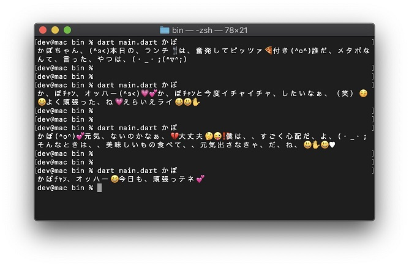

# A dart:ffi sample to use a shared library generated by cgo

## 準備

1. [cgo_ojichat](https://github.com/kaboc/cgo_ojichat) の説明に従ってライブラリを生成する
2. 生成されたライブラリを `bin` の中に置く

## 実行

```shell script
$ dart bin/main.dart あなたのお名前
```


